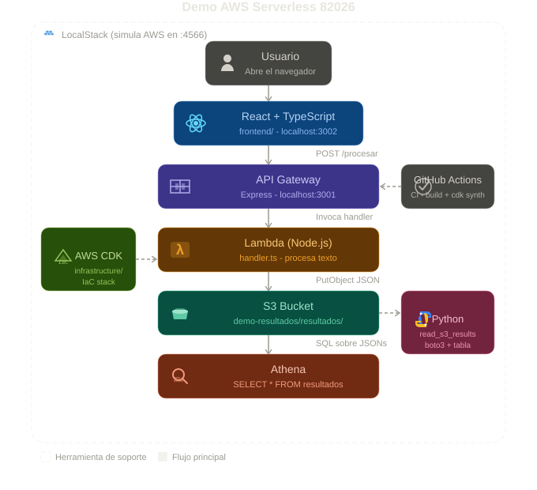

# Demo AWS Serverless — 82026

Demostración técnica **Fullstack + Cloud**: pipeline serverless con React, Lambda, API Gateway, S3, Athena e infraestructura como código (CDK). Incluye entorno local con **LocalStack** y despliegue objetivo en **AWS**.

**Repositorio:** [github.com/NicoParraDev/emo-aws-serverless-82026](https://github.com/NicoParraDev/emo-aws-serverless-82026)

---

## Diagrama de arquitectura

Diagrama en la **raíz del proyecto** (con icono por servicio):

**`demo_82026_arquitectura.svg`**

<p align="center">
  
</p>

Iconos en el diagrama: Usuario, React, API Gateway, Lambda, S3, Athena, CDK, Python, GitHub Actions y LocalStack.

> **Leyenda:** cajas con borde sólido = implementado y probado en local. Cajas punteadas = definidas en CDK para producción en AWS.

---

## Las 3 capas del proyecto

### Capa 1 — Presentación

| Componente | Rol | Código |
|------------|-----|--------|
| **React + TypeScript** | UI para ingresar texto y ver resultados | `frontend/` |
| **Nimbus UI** | Componentes (input, botón, tabla, badges) | `frontend/src/ui/` |
| **CloudFront + S3** *(AWS)* | Sirve el build estático del frontend | `infrastructure/` (CDK) |

El usuario escribe un texto (ej. contrato, factura). Al pulsar **Procesar**, el front envía `POST /procesar` con `{ "texto": "..." }`.

### Capa 2 — API y cómputo

| Componente | Rol | Código |
|------------|-----|--------|
| **API Gateway** | Expone `POST /procesar` con CORS | Local: `backend/src/server.ts` (Express) |
| **AWS Lambda** | Procesa el texto y genera métricas | `backend/src/handler.ts` |
| **AWS CDK** | Infraestructura como código (IaC) | `infrastructure/lib/infrastructure-stack.ts` |

**Lambda** calcula:

- `palabras` — conteo por espacios  
- `caracteres` — longitud del string  
- `fecha` — ISO timestamp  

Respuesta HTTP 200 con JSON y cabecera `Access-Control-Allow-Origin: *`.

### Capa 3 — Datos y analítica

| Componente | Rol | Código / recurso |
|------------|-----|------------------|
| **Amazon S3** | Persistencia de cada resultado como JSON | Bucket `demo-resultados`, prefijo `resultados/` |
| **Amazon Athena** | Consulta SQL sobre archivos en S3 | `backend/src/setupAthena.ts`, DB `demo_db`, tabla `resultados` |
| **Python + boto3** | Lectura y resumen de objetos S3 (equivalente operativo a Athena en local) | `python/read_s3_results.py` |

Cada procesamiento crea un archivo: `resultados/{timestamp}.json`.

---

## Flujo de datos (paso a paso)

```
Usuario → React → POST /procesar → API Gateway → Lambda → S3
                                                      ↓
                                            Athena / Python (consulta)
```

1. **Entrada:** texto en la interfaz Nimbus.  
2. **Request:** `POST http://127.0.0.1:3001/procesar` (local) o `/procesar` vía CloudFront (AWS).  
3. **API Gateway:** enruta al handler (Express local o integración Lambda en AWS).  
4. **Lambda:** parsea body, procesa, construye objeto resultado.  
5. **S3:** `PutObject` con `Content-Type: application/json`.  
6. **Consulta:** Athena (`SELECT * FROM demo_db.resultados`) o script Python listando el bucket.  
7. **CI:** GitHub Actions valida build, types y `cdk synth` en cada push a `main`.

---

## Estructura del repositorio

```
demo-82026/
├── demo_82026_arquitectura.svg       # Diagrama con iconos (raiz del repo)
├── frontend/                         # React + TypeScript
├── backend/
│   ├── README.md                     # Contrato API y comandos npm
│   ├── src/handler.ts                # Lambda (lógica de negocio + S3)
│   ├── src/server.ts                 # API Gateway local (Express)
│   ├── src/setupAthena.ts            # Crear tabla Athena
│   ├── src/queryS3Resultados.ts      # Consulta S3 (fallback local)
│   └── src/testLocal.ts              # Probar Lambda sin HTTP
├── infrastructure/                   # AWS CDK: S3, Lambda, API GW, CloudFront
├── python/
│   ├── read_s3_results.py            # Consulta resultados en S3
│   └── requirements.txt
├── .github/workflows/ci.yml          # Pipeline CI
├── iniciar-demo.ps1                  # Arranque automático (Windows)
└── README.md
```

---

## Stack tecnológico

| Área | Tecnología |
|------|------------|
| Frontend | React 18, TypeScript, Axios |
| Backend | Node.js 20, TypeScript, Express (dev), AWS SDK v3 |
| Cloud | Lambda, API Gateway HTTP API, S3, Athena, CloudFront |
| IaC | AWS CDK 2.x (TypeScript) |
| CI/CD | GitHub Actions |
| Scripts | Python 3 + boto3 |
| Local | Docker, LocalStack (`:4566`) |

---

## Ejecución local

### Requisitos

- Docker Desktop  
- Node.js 20+  
- AWS CLI  
- LocalStack CLI  
- Python 3.12+ (opcional)

### Arranque rápido (Windows)

```powershell
cd C:\Users\nicoa\Desktop\demo-82026
.\iniciar-demo.ps1
```

Abre el navegador en la URL que indique `npm start` (normalmente `http://localhost:3000` o `:3002`).

### Manual

**1. LocalStack**

```bash
localstack start
```

**2. Buckets S3**

```bash
aws --endpoint-url=http://127.0.0.1:4566 s3 mb s3://demo-resultados
aws --endpoint-url=http://127.0.0.1:4566 s3 mb s3://demo-athena-results
```

**3. Backend** (API en `127.0.0.1:3001`)

```bash
cd backend
npm run dev
```

**4. Frontend**

```bash
cd frontend
npm start
```

**5. Verificar S3** (después de procesar un texto en la UI)

```bash
aws --endpoint-url=http://127.0.0.1:4566 s3 ls s3://demo-resultados/resultados/
```

**6. Script Python**

```bash
cd python
pip install -r requirements.txt
export AWS_ENDPOINT_URL=http://127.0.0.1:4566
export AWS_ACCESS_KEY_ID=test
export AWS_SECRET_ACCESS_KEY=test
python read_s3_results.py --bucket demo-resultados
```

---

## Despliegue en AWS (CDK)

```bash
cd frontend && npm run build
cd ../infrastructure
npm install
npm run build
npx cdk bootstrap    # solo la primera vez
npx cdk deploy
```

**Outputs:** URL CloudFront, URL API Gateway, nombres de buckets S3, nombre de la función Lambda.

Recursos definidos en CDK:

- Buckets S3 (resultados, Athena, web estático)  
- Lambda empaquetada desde `backend/src/handler.ts`  
- HTTP API con ruta `POST /procesar`  
- CloudFront: frontend en `/` y API en `/procesar`  

---

## Entorno local vs producción

| Aspecto | Local (LocalStack + Express) | Producción (AWS + CDK) |
|---------|------------------------------|-------------------------|
| API Gateway | Express `:3001` | HTTP API |
| Lambda | Mismo `handler.ts` vía Express | Función Lambda desplegada |
| S3 | `http://127.0.0.1:4566` | S3 regional |
| Frontend | `npm start` (CRA) | CloudFront + S3 |
| Athena | Limitaciones en tier free; fallback Python / `queryS3Resultados.ts` | Athena gestionado |

---

## CI — GitHub Actions

Workflow `.github/workflows/ci.yml`:

- Instala dependencias (`backend`, `frontend`, `infrastructure`)  
- `tsc --noEmit` en backend  
- `npm run build` en frontend  
- Tests frontend  
- `cdk synth`  
- Validación sintaxis Python  

---

## Demo en entrevista (guion corto)

1. Mostrar **UI** — procesar un texto, ver tabla.  
2. **F12 → Network** — `POST /procesar`, JSON de respuesta.  
3. **Terminal** — `aws s3 ls s3://demo-resultados/resultados/`.  
4. **GitHub** — repo + `demo_82026_arquitectura.svg` + `infrastructure-stack.ts`.  
5. Frase: *"Pipeline serverless: React, API Gateway, Lambda, S3; consulta analítica con Athena; infra con CDK; probado en LocalStack."*

---

## Autor

Proyecto de demostración — proceso de selección **82026**.
